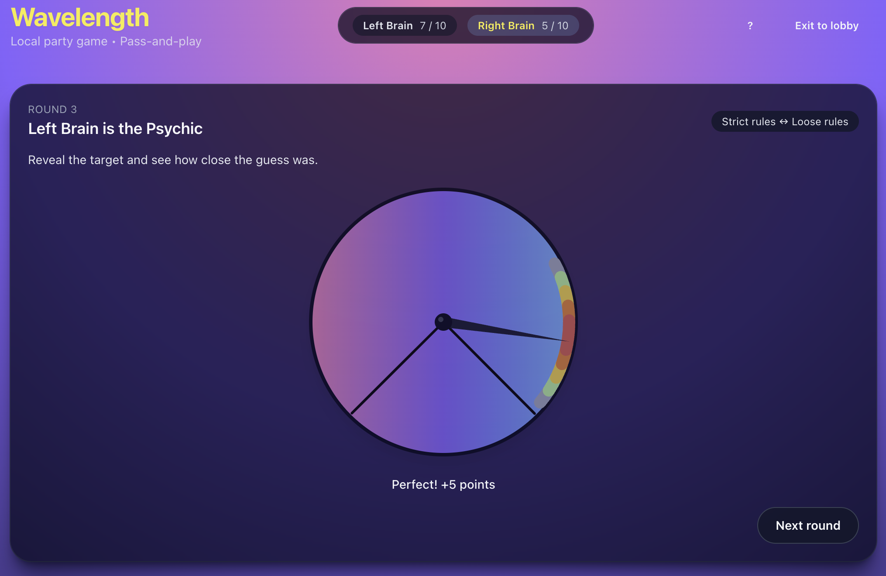

<h1 align="center">Hi 👋 I'm Tomi</h1>

  <strong>Frontend Engineer from 🇦🇷 Argentina</strong>
   
  Building polished web and mobile experiences with React, React Native & TypeScript.

  

  

  

  

---

# 👨‍💻 About Me

I'm a **Frontend Engineer with 2+ years of professional experience** building React and React Native applications for startups.

I enjoy transforming ideas into polished products, focusing on clean architecture, performance and delightful user experiences.

Currently I'm expanding my knowledge in **AI workflows**, **modern frontend architecture**, and **system design**, while continuously building personal projects.

### A few things about me

- ⚛️ React & React Native specialist
- 🚀 Passionate about UI/UX and product engineering
- 🏗️ Building side projects from idea to production
- 📚 Lifelong learner
- 🏋️ Gym enthusiast
- 🎸 Guitar player
- 🎲 Board game fan

---

# 🚀 Featured Projects

## 🎲 Wavelength Online

A recreation of the popular board game **Wavelength**, allowing friends to play together online from anywhere.

### Built with

- React
- TypeScript
- Tailwind CSS
- Responsive Design

🔗 **Deployed Game:** https://wavelength-game.fun

---

## 👞 Landing Page for F. Hojnadel

A premium landing page for a wholesale shoe company with a strong focus on performance and user experience.

### Highlights

✅ 100 Performance

✅ 100 Accessibility

✅ 100 Best Practices

✅ 100 SEO

🔗 **Deployed Landing Page:** https://fhojnadel.com

---

# 🛠 Tech Stack

### Frontend

### Mobile

 React Native

### Tools

---
## 📈 GitHub Stats

  
  

---

# 🤝 Let's Connect

I'm always interested in discussing frontend engineering, startups, side projects or new opportunities.

